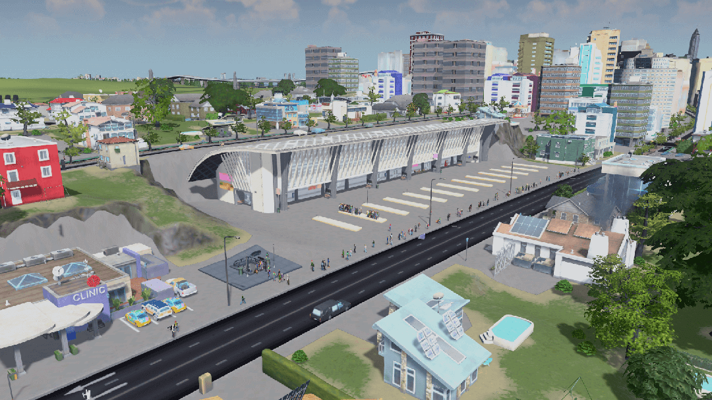

# Top 5 Best Ways To Reduce Traffic In Cities: Skylines 1
Are You Tired Of Traffic In your Big City In Cities: Skylines 1?  Well We Have Gathered The 5 Best Ways To Reduce Traffic Without Mods And Without Much Effort

## 1: Think About How You Are Gonna Build Your City
It's really important to think how you are gonna construct your city, you can always go for the blocky-style residentials which is good in the early game where you are trying to unlock everything and get money, but further down the line it will cause you massive headaches to 'improve' that area. and if you are going to do that make sure its easy to remove or enhance later on. And also make sure there is not too many intersections or else traffic will pile up over time from your industry, commercial, residentials.

## 2: Use Public Transport 
This is the most obvious option and the best way to reduce traffic or completely erradicate it. From personal experience, making it so your citizens have to use their cars over very long distance and then deliberately using, for example: Underground Metro Station, Trams, etc. makes them take the public transport options a lot more often.

## 3: Lane Mathematics
By far the best option of fixing traffic pile-up. Think about it like this, you have a 3 lane highway that has a 1 way exit to the right. if you pay attention, the right lane has an option to still go straight and right, what you need to employ is to upgrade the road in front of the right to a 2 lane and then the vehicles on the right lane are forced to take a right exit. basically 3 minus 1 so it equals to 2.

## 4: Walking paths

## 5: Building multiple cities
