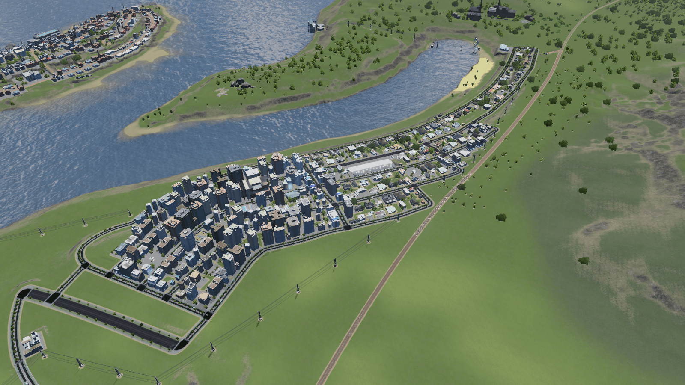
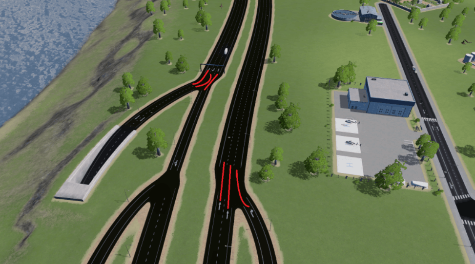

# Top 5 Best Ways To Reduce Traffic In Cities: Skylines 1
Are You Tired Of Traffic In your Big City In Cities: Skylines 1? We Have Gathered The 5 Best Ways To Reduce Traffic Without Mods And Without Much Effort!

## 1: Think About How You Are Gonna Build Your City
You can always go for the blocky-style residentials which is good in the early game where you are trying to unlock everything and get money, but further down the line it will cause you massive headaches to 'improve' that area. and if you are going to do that make sure its easy to remove or enhance later on.

## 2: Use Public Transport 
This is the most obvious option and the best way to reduce traffic or completely erradicate it in the game. From personal experience, making it so your citizens have to use their cars over very long distance and then deliberately using, for example: Underground Metro Station, Trams, etc, makes them take the public transport options a lot more often.

## 3: Lane Mathematics
By far the best option of fixing traffic pile-up. if you look closely you can see that the road to the right has one way straight into the highway whilst the other lanes on the road before it have their own lane. what you need to do is to make the road behind / in front the entrance of a 1 way road a two way (depending on the size of your road, Look at the left top side of the screenshot) so they are assigned their own dedicated lane instead of heading straight on the lane that is coming through

## 4: Walking paths
Walking paths are extremely versatile when used correctly. Your citizens love walking, And by using pathways it will reduce the traffic in your city greatly. Here is a demonstration of how i have done it.

[Walkways And Its use](cities-skylines-walkways-guide.png)
## 5: Building multiple cities
By far the least done option, It is good to build smaller cities, But over time, you will run out of space to build (around 100k - 150k) and it will facilitate traffic off your main city.
